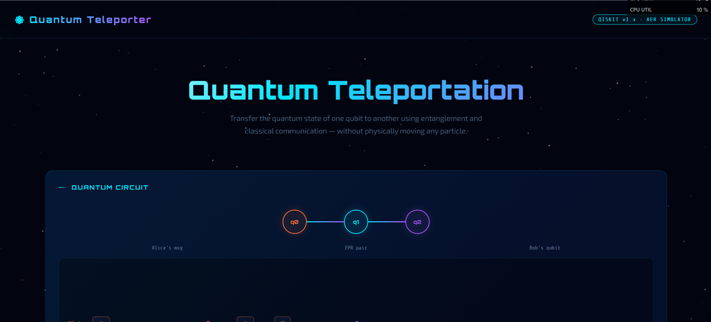

<div align="center">

# ⚛️ Quantum Teleportation

### Interactive simulation of quantum state teleportation using Qiskit + React

[](https://python.org)
[](https://qiskit.org)
[](https://react.dev)
[](https://vitejs.dev)
[](LICENSE)

<br/>

> Transfer the quantum state of one qubit to another using entanglement and classical communication — without physically moving any particle.

<br/>



</div>

---

## 📖 Overview

This project demonstrates **quantum teleportation** — one of quantum computing's most fundamental protocols. It combines:

- A **Qiskit / Python** backend that simulates the full circuit on `AerSimulator`
- A **React + Vite** frontend with an animated circuit diagram, real-time Bell measurement histograms, and step-by-step protocol walkthrough

Quantum teleportation transmits an arbitrary quantum state |ψ⟩ from Alice to Bob using:
1. A shared entangled Bell pair
2. A Bell measurement by Alice
3. Two classical bits sent to Bob
4. Conditional unitary corrections by Bob

No quantum information physically travels — the state is reconstructed through quantum correlations.

---

## ✨ Features

- 🔬 **Animated quantum circuit diagram** — drawn with the HTML5 Canvas API, highlights each gate as it executes
- 📊 **Live Bell measurement histogram** — animated bar chart with real shot counts
- 🧮 **Metrics dashboard** — fidelity %, Shannon entropy, Bell uniformity, run count
- 🎛️ **State selector** — teleport `|0⟩`, `|1⟩`, `|+⟩`, or `|-⟩`
- 🎚️ **Adjustable shots** — 128 to 8192 shots via slider
- 🌌 **Animated starfield** background with smooth CSS transitions
- 📋 **Syntax-highlighted source** with one-click copy
- 📱 **Fully responsive** — works on mobile and desktop
- 🔔 **Toast notifications** + live status bar

---

## 🧪 The Teleportation Protocol

| Step | Gate(s) | Description |
|------|---------|-------------|
| **01** | `X` | Prepare the state to teleport on qubit q₀ |
| **02** | `H`, `CNOT` | Create a Bell pair (entanglement) between q₁ and q₂ |
| **03** | `CNOT`, `H` | Bell measurement — entangle q₀ with q₁ |
| **04** | `Measure` | Measure q₀ and q₁, send 2 classical bits to Bob |
| **05** | `CNOT`, `CZ` | Bob applies corrections — q₂ now holds Alice's original state |

The Bell measurement yields `00`, `01`, `10`, `11` with equal ~25% probability. Regardless of outcome, Bob's corrections always reconstruct the original state — giving near-perfect fidelity.

---

## 🗂️ Project Structure

```
quantum-teleport/
├── index.html                  # Vite HTML entry point
├── vite.config.js              # Vite + React plugin config
├── package.json                # Node dependencies
├── main.py                     # Python / Qiskit simulation
├── requirements.txt            # Python dependencies
└── src/
    ├── main.jsx                # React entry point
    ├── App.jsx                 # Root component & state management
    ├── App.module.css          # Layout & component styles
    ├── index.css               # Global CSS variables & keyframe animations
    ├── components/
    │   ├── Starfield.jsx       # Animated canvas starfield background
    │   ├── CircuitCanvas.jsx   # Quantum circuit diagram (Canvas API)
    │   ├── Histogram.jsx       # Animated Bell measurement results chart
    │   ├── CodeBlock.jsx       # Syntax-highlighted Python source viewer
    │   └── *.module.css        # Scoped CSS modules per component
    └── utils/
        ├── quantum.js          # Simulation logic & statistical analysis
        └── constants.js        # Step definitions & quantum state data
```

---

## 🚀 Getting Started

### Prerequisites

| Requirement | Version |
|-------------|---------|
| Node.js | `22.12+` or `20.19+` |
| npm | `8+` |
| Python | `3.8+` |

> ⚠️ **Node.js version matters!** Vite 4 requires Node `20.19+` or `22.12+`. Download the latest LTS from [nodejs.org](https://nodejs.org).

---

### Installation

**1. Clone the repository**
```bash
git clone https://github.com/IssacManova/Quantum-Teleportation.git
cd Quantum-Teleportation
```

**2. Install Node dependencies**
```bash
npm install
```

**3. Install Python dependencies**
```bash
pip install qiskit qiskit-aer matplotlib
```

**4. Start the dev server**
```bash
npm run dev
```

Open [http://localhost:5173](http://localhost:5173) in your browser. 🎉

---

### Run the Python simulation (standalone)

```bash
python main.py
```

This runs the circuit directly with `AerSimulator` and prints the Bell measurement counts to the terminal.

---

## 🛠️ Build for Production

```bash
npm run build
```

Output goes to `dist/`. Preview it with:
```bash
npm run preview
```

---

## 🔬 How It Works

### Python / Qiskit (`main.py`)

```python
from qiskit import QuantumCircuit, transpile
from qiskit_aer import AerSimulator

qc = QuantumCircuit(3, 2)

qc.x(0)           # Prepare |1⟩
qc.h(1)           # Hadamard on EPR qubit
qc.cx(1, 2)       # Create Bell pair

qc.cx(0, 1)       # Bell measurement
qc.h(0)

qc.measure(0, 0)  # Measure to classical bits
qc.measure(1, 1)

qc.cx(1, 2)       # Bob's corrections
qc.cz(0, 2)

simulator = AerSimulator()
result = simulator.run(transpile(qc, simulator), shots=1024).result()
print(result.get_counts())
```

### React Frontend (`src/`)

The UI is built entirely with React hooks and CSS Modules — no UI library dependency. The circuit diagram uses the **HTML5 Canvas API** for pixel-perfect rendering with glow effects.

---

## 📦 Dependencies

### Python
| Package | Purpose |
|---------|---------|
| `qiskit` | Quantum circuit construction |
| `qiskit-aer` | High-performance simulator backend |
| `matplotlib` | Plot histogram results |

### Node
| Package | Version | Purpose |
|---------|---------|---------|
| `react` | 18.2.0 | UI framework |
| `react-dom` | 18.2.0 | DOM rendering |
| `vite` | 4.5.3 | Build tool & dev server |
| `@vitejs/plugin-react` | 4.2.1 | JSX transform |

---

## 🧠 Concepts Explained

<details>
<summary><strong>What is a Bell state?</strong></summary>

A Bell state is a maximally entangled two-qubit state. The one used here is:

```
|Φ+⟩ = (|00⟩ + |11⟩) / √2
```

Measuring one qubit instantly determines the other's state, regardless of distance.
</details>

<details>
<summary><strong>Why are the measurement results always ~25% each?</strong></summary>

The Bell measurement on Alice's side yields one of four outcomes (`00`, `01`, `10`, `11`) with equal probability. This randomness is fundamental — but Bob's corrections are defined for each case, so the teleportation always succeeds.
</details>

<details>
<summary><strong>Does this violate the no-cloning theorem?</strong></summary>

No. The original state on Alice's qubit is destroyed during measurement. The state is transferred, not copied — fully consistent with the no-cloning theorem.
</details>

<details>
<summary><strong>Is this faster-than-light communication?</strong></summary>

No. Bob needs the 2 classical bits from Alice (which travel at normal speed) before he can apply the correct gates. No information is transmitted faster than light.
</details>

---

## 📄 License

This project is licensed under the **MIT License** — see the [LICENSE](LICENSE) file for details.

---

<div align="center">

Made with ⚛️ and 💙 · [Qiskit](https://qiskit.org) · [React](https://react.dev) · [Vite](https://vitejs.dev)

</div>
